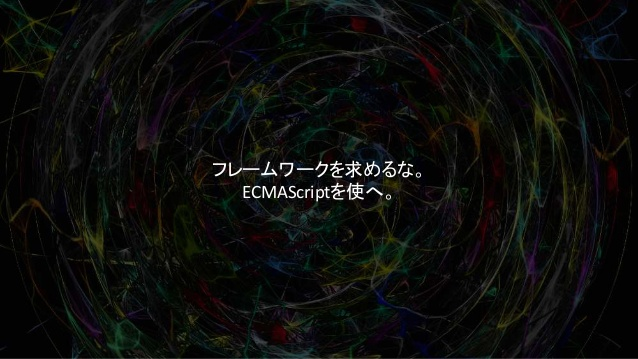

ECMAScript just as a framwork.

No React (+Redux), Mithril, mercury, Riot.js et al. We've used [virtual-dom](https://github.com/Matt-Esch/virtual-dom) library & wrote [100 lines of code](./web/lib) then [mapped JSX to plain old ECMAScript function](./lib/jsx_loader.js).

- - -

jsx_todo_sample
==

virtual-dom JSX sample of a full featured todo application.

Start the server.

```sh
make
npm start
```

Then access to http://localhost:3000/

Main concept
--
<a href="//www.slideshare.net/sachirouinoue/ecmascript-64695595" title="フレームワークを求めるな。ECMAScriptを使へ。" target="_blank"><br/>フレームワークを求めるな。ECMAScriptを使へ。</a>

Features
--
- [x] Small runtime libraries
- [x] JSX
- [x] Plain old ECMAScript
- [x] Highly modulated code
- [x] Redux like Flux architecture
- [x] Batch DOM changes with `window.requestAnimationFrame()`
- [x] reactjs/react-tabs like tab component
- [x] Server-side rendering

TODO
--
- [ ] Offline app by IndexedDB & ServiceWorker.
- [ ] History API
- [ ] Relay
- [ ] http://todotxt.com/
- [ ] Test, mocha + WebdreiverIO, [aXe](https://github.com/dequelabs/axe-core), test, test
- [ ] Reduce runtime deps by [incremental-dom](https://github.com/google/incremental-dom) or [html-patcher](https://github.com/azer/html-patcher).
- [ ] [critical](https://github.com/addyosmani/critical)
- [ ] WebComponent. Custome elements & HTML import.
- [ ] GOAL. Framworkless. Extract tools & libraries from here.
